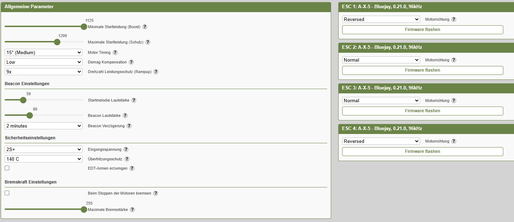
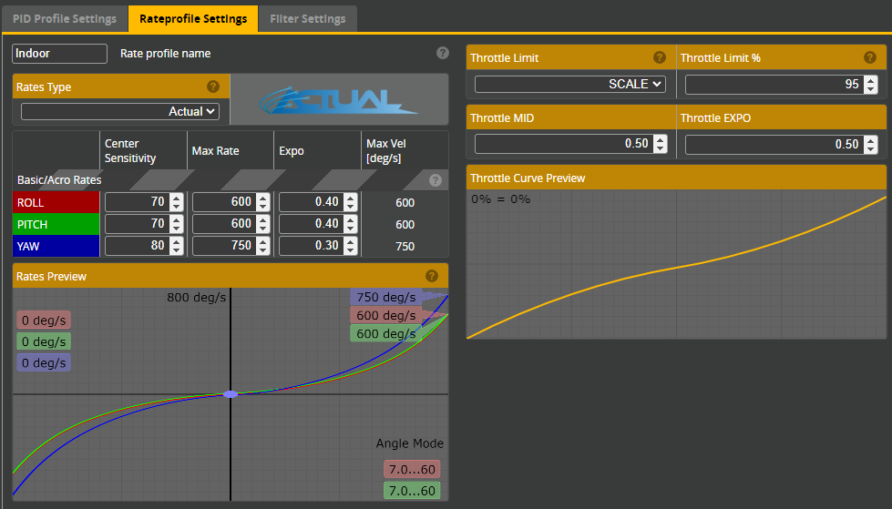
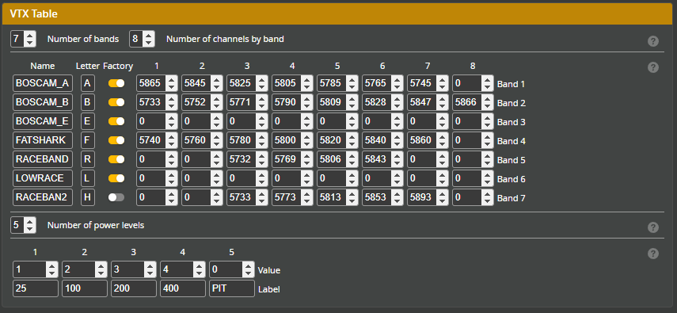

# BetaFPV Air65 FPV Drone Settings & Firmware

This repository contains the latest firmware configuration files, and ESC settings for my **Air65 FPV drone**.
It serves as a personal backup and reference for flashing, tuning, and restoring the quad.
It's for the **Racing** Version (***27kKV***), but should work on all other KVs.
***Stock/Defaults/Factory*** settings included.

---

## Contents
- **/betaflight/** → Latest Betaflight CLI dumps  
- **/esc/** → ESC settings (Bluejay)  
- **/configs/** → Screenshot files (PID tuning, rates, etc.)
- **/osd-font/** → Improved/my version of the Vision font

---

## Notes
- Drone: **BetaFPV Air65 Racing**  
- FC: ***BETAFPVG473 (STM32G47X)*** (*AiO*)
- ESC: ***A-X layout***
  - ***96kHz***, 48kHz feels *not correct*
  - ***2S+*** should be used instead of ***1S***
  - Overheatprotection can be safely turned off
- ELRS: ***250Hz*** / ***2.4GHz***

---

## Screenshots

---

## Disclaimer
These files are tailored for me.
Use at your own risk — incorrect flashing or configs may damage your hardware.
